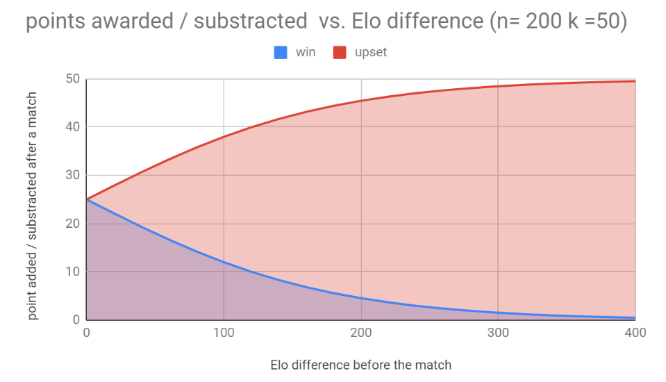

## Who is this Elo guys, anyway?

Arpad Elo originally invented the Elo ranking system for chess,
variant of this simple yet very accurate system is now used in many places like
for the matchmaking in most online video games.
To know more about Mr. Elo,
[you can check his wikipedia page here](https://en.wikipedia.org/wiki/Arpad_Elo).

## The Elo ranking … short explanation

Elo ranking is a point-based system where the point earned by the winner of a match is determined by the chance he had of winning before the match.

So imagine an NHL match where the 2019 Kings beat the 2019 Lightning. Since it’s a big upset, the league decided to award the kings 6 points instead of 2. But it’s not all, they also subtract 6 points to the lightning for their poor performance! If as expected, the lightning had won, the league would be much less impressed and would only give the lightning 1 point and subtract 1 point to the Kings.

Basic elo ranking setup is as follows. The average team has a score of around 1500 and win between 2 equal strength teams will award the winner 50 points and remove 50 points to the loser.

Feel free to stop here, you now have a basic understanding of how elo ranking work.

If you want to know more about the statistics behind this ranking system, let’s go

## The Elo ranking … long explanation

Now that you have a basic understanding of the elo ranking, here is a detailed description of the parameters you need to provide in order to use the elo ranking.

To set up a league using the ELO ranking you will need to provide 3 pieces of information. The n-Factor, the k-factor and the base rating of each player. For those of you who are not math savvy, here is the 5 years old version of those 3 parameters:

base rating

#### n-Factor:

the N factor represents the difference in point to make a player of team 10 times more likely to win the game. Let’s say we give the n-Factor a value of 400. If Lucy has an elo of 1500 and Nancy has an elo of 1900. We expect Nancy to win around 9 times out of 10.

#### k-Factor:

The k-Factor represents the number of points in play during a game. If 2 players of the exact same Elo play against each other, the winner will receive half the value of K. If the K factor is high relative to the n-factor, the ranking will change a lot after each match. In the opposite, if the K factor is low, a player will need to win a lot of games to see his ranking change.

#### BaseRating:

The base rating is an arbitrary value you put a player or team before the season begins. It can be any number but if must be balanced with the other 2 factors. Typical starting rating are around 1200-1500.

### Typical values

As we see, the 3 values are intimately linked, so one must choose them wisely. The value you set depends on the goals you are trying to achieve. Let’s see some scenarios and some suggested values.

#### A sample tennis league

We run a tennis league with 30 players of varied skills. To make it interesting for
everyone we want to schedule a match between players of the same skill level. But
since we are not so sure of the skill level of everyone, we will need the elo rating help to make the right pairing.

12 matches will be players during the season. That's not a lot of matches compared
to the NHL season (82 matches per team) or the MLB season (160 matches per team).
It’s more like the NFL season where each team plays only 16 matches before the
playoffs. Luckily for us, the folks at
[https://fivethirtyeight.com/features/introducing-nfl-elo-ratings/](https://fivethirtyeight.com/features/introducing-nfl-elo-ratings/)
used the elo rating to make NFL prediction since 2014. Let’s use their numbers as a base. They use n = 400, k = 20 and a base rank of 1500.

Let’s say we made 2 groups, one starting at 1400 and one at 1500. How many games
would it take for a 1400 elo player that wins all of his games to beat a 1500 elo
player that loses all of his?

If we assume that matches are always played between players of the exact same elo,
with a k factor of 20, the winner will get 10 points and the loser will lose 10.
After 5 games, they will meet in the middle at 1450 elo points. If we crank up the
k factor to 50, a win will now worth 25 and both will reach a score of 1450 after
only 2 games.

Where you set the k factor depends on how fast you want players to be able to climb
up or fall in the ranking. **For a league with few matches and a lot of uncertainty
about the player's skills, a k factor of 50 is a good starting point.**

We can also tweak the n factor to adjust the meaningfulness of the elo difference
between the 2 players. Remember that the n factor represents the gap in elo point
where the highest-rated player is 10 times more likely to win. Lowering the n factor
will make an upset more rewarding or punishing depending on which side of the upset
you are. With n=400, upsetting an opponent 100 elo higher award 32 points.
With n=200 the same upset will award 38 points. To make things more interesting,
let's use 200 for our n factor.

### Conclusion

ELO rating is awesome for a league where there is big skills gap between players or teams.
It permits the organizer to program matches between players of the same skills while still
letting lower-ranked players climb up the ladder if they get better or if they were
wrongly ranked at the beginning of the season. As opposed to a league with clear
division where a player ranked in a lower division might feel it doesn’t belong there
and has no possibility to prove it before the next season, the ELO ranking is dynamic
and more true to real player skills.

[the ELO league feature in coming to the SportMngr app soon...](https://www.sportmngr.com)
